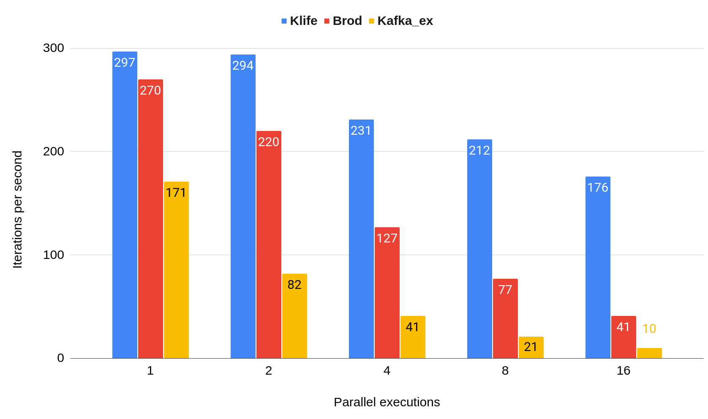

# Klife

Klife is a performance focused Kafka client written from scratch with minimal dependencies. For now it provides only
producer features but consumer will be done in the future.

Klife leverages [Klife Protocol](https://github.com/oliveigah/klife_protocol) in order to provide batch eficiency and
future proof compatibility with newer versions of the protocol.

The batch eficiency enable Klife to achieve great performance compared with other community clients, seeing increases of
produce throughput up to 15x in some cases.

## Features

For now Klife have only producer features, but it is a on going project that will evolve into a consumer as well.

- Batch all data to the same broker within a single TCP request per producer
- Minimal resource usage, only one connection per broker for each client
- Synchronous produce returning the offset
- Asynchronous produce with callback
- Batch produce API for different topics/partitions
- Automatic handle cluster and metadata changes
- Testing helper functions to avoid mocking and run tests against a real broker
- Simple configuration
- Comprehensive documentation with examples and tradeoffs
- Custom partitioner per topic
- Support for transactions (ecto style)
- SASL authentication (only plain for now)
- Support for recent versions of the protocol

## Usage

Checkout the `Klife.Client` docs to have more details, but the basic usage is something like this:

#### 0. Add on deps

```elixir
{:klife, "~> 0.1.0"},
```

#### 1. Add config

```elixir
config :my_app, MyApp.Client,
  connection: [
    bootstrap_servers: ["localhost:19092", "localhost:29092"],
    ssl: false
  ]
```

#### 2. Use it on a module

```elixir
defmodule MyApp.Client do
  use Klife.Client, otp_app: :my_app
end
```

#### 3. Starting it on your supervision tree

```elixir
children = [ MyApp.Client ]

opts = [strategy: :one_for_one, name: Example.Supervisor]
Supervisor.start_link(children, opts)
```

#### 4. Call the producer API on your code

```elixir
my_rec = %Klife.Record{value: "my_val_1", topic: "my_topic_1"}
{:ok, %Klife.Record} = MyApp.Client.produce(my_rec)
```

## Producer performance

In order to test the performance I've prepared a benchmark that uses [benchee](https://github.com/bencheeorg/benchee) to produce
kafka records on kafka cluster running locally on my machine.

The details can be checked out on `benchmark.ex` mix task and the results on `bechmark_results`.

To reproduce it on your setup you can run (16 is the benchee parallel value):

```
bash start-kafka.sh
mix benchmark producer_sync 16
```

Each iteration of the benchmark produces 3 records for 3 different topics in paralel and wait for the completion
in order to move to the next iteration.

I've test it against the 2 awesome community kafka libraries [brod](https://github.com/kafka4beam/brod)
and [kafka_ex](https://github.com/kafkaex/kafka_ex) which are the most popular ones.

The main point driving the Klife's performance is the batching efficiency. As far as I can tell:

- Klife: Batches everything that can be batched together in a single TCP request
- Brod: Batches records only for the same topic/partition in a single TCP request
- Kafka_ex: Does not batch records (I'm not sure if there is a way to change this behaviour)

The relevant client configuration are equal on all clients and they are:

- required_acks: all
- max_inflight_request: 1
- linger_ms: 0
- max_batch_size: 512kb

With this scenario I've executed the benchmark increasing the `parallel` attribute from
benchee from 1 to 16, doubling it each round. The results are the following:


